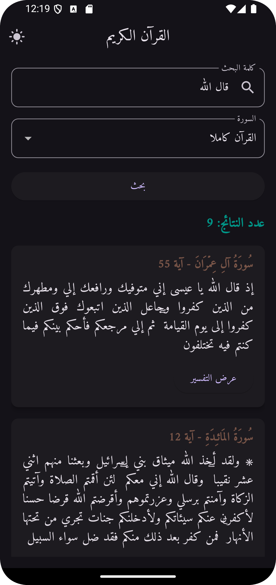

# Quran App

The Quran Search App allows users to search Quranic verses, view Tafseer (explanations), and explore teachings with ease. It features a clean interface with light and dark modes for an enhanced experience.


---

## Features

### 1. **Search Quran Verses**
- Allows users to search for specific keywords or phrases in the Quran.
- Displays relevant verses matching the search term along with their context.

### 2. **Surah Selection**
- Users can narrow down their search to specific Surahs (chapters) of the Quran.
- Includes a dropdown menu for selecting Surahs.

### 3. **Tafseer View**
- Displays the Tafseer (explanation) of any selected verse in a detailed manner.
- Currently, the app provides **التفسير الميسر** as the Tafseer option.
- Users can toggle between showing and hiding the Tafseer.

### 4. **Dark/Light Mode Toggle**
- Users can switch between light and dark themes for a comfortable viewing experience.
- Ensures better readability during day or night usage.

### 5. **About Page**
- Provides information about the app's purpose and mission.

---

## Screenshots

### Initial Screen


### Limit Search by Surah


### Light Mode Search Results


### Dark Mode Search Results


### Toggle Tafseer View


---

## Installation

1. Clone the repository:
   ```bash
   git clone https://github.com/AbdelrhmanUZaki/quran_flutter
   ```
2. Navigate to the project directory:
   ```bash
   cd quran_flutter
   ```
3. Install dependencies:
   ```bash
   flutter pub get
   ```
4. Run the app:
   ```bash
   flutter run
   ```

---

## Contributions
Feel free to open issues and create pull requests. Contributions are welcome to improve the app and add new features.
